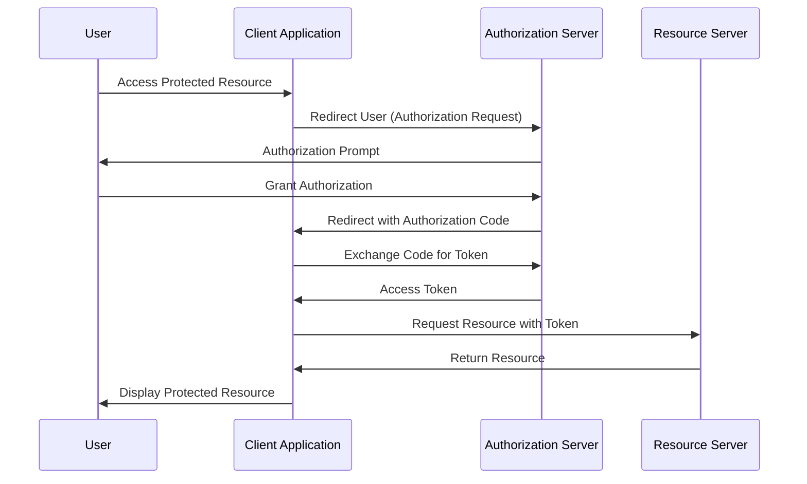
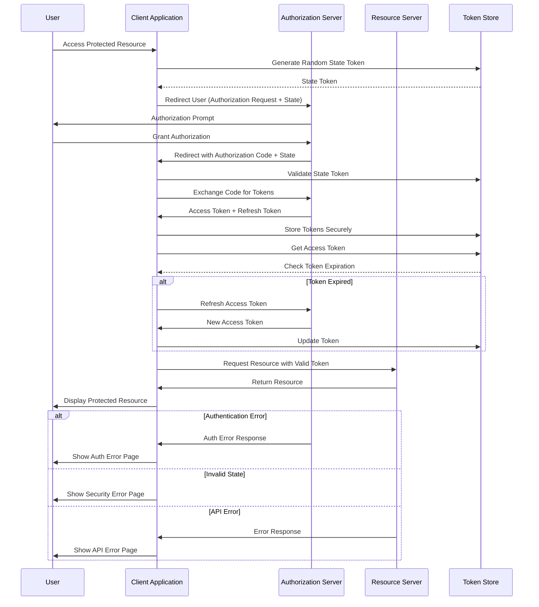

# OAuth認証の認証フロー

## 基本的な処理フロー

1. Userがアプリケーションにアクセス
2. クライアントが認証サーバーにリダイレクト
3. 認証サーバーがユーザーに認可を要求
4. ユーザーが認可を承認
5. クライアントが認可コードとトークンを交換
6. クライアントがAPIからリソースを取得
7. リソースサーバーがリソースを返却
8. クライアントが取得したリソースをユーザーに表示

## エラーハンドリングやトークンストアを踏まえた処理フロー

### 1. 初期認証フロー

1. 保護されたリソースへのアクセス要求
ユーザーがクライアントアプリケーションにアクセスし、保護されたリソースを要求します。
    - User → App: Access Protected Resource
2. ランダムなStateトークンの生成
クライアントアプリケーションがランダムなStateトークンを生成し、安全なストレージに保存します。
    - App → Store: Generate Random State Token
    - Store → App: State Token
3. 認可リクエストの送信
クライアントアプリケーションが認可サーバーにユーザーをリダイレクトし、Stateトークンを含む認可リクエストを送信します。
    - App → Auth: Redirect User (Authorization Request + State)
4. 認可プロンプトの表示
認可サーバーがユーザーに対して認証と認可を求めます。
    - Auth → User: Authorization Prompt
5. 認可の承認
ユーザーが認可を承認します。
    - User → Auth: Grant Authorization
6. 認可コードのリダイレクト
認可サーバーがクライアントアプリケーションに認可コードとStateトークンをリダイレクトします。
    - Auth → App: Redirect with Authorization Code + State
7. Stateトークンの検証
クライアントアプリケーションが保存したStateトークンを使用して検証を行い、CSRF攻撃を防ぎます。
    - App → Store: Validate State Token

### 2. トークン取得フロー

8. アクセストークンとリフレッシュトークンの取得
クライアントアプリケーションが認可コードを使用して、アクセストークンとリフレッシュトークンを取得します。
    - App → Auth: Exchange Code for Tokens
    - Auth → App: Access Token + Refresh Token
9. トークンの安全な保存
クライアントアプリケーションが取得したトークンを安全なストレージに保存します。
    - App → Store: Store Tokens Securely

### 3. リソースアクセスフロー

10. アクセストークンの取得と有効性の確認
クライアントアプリケーションがストレージからアクセストークンを取得し、有効期限を確認します。
    - App → Store: Get Access Token
    - Store → App: Check Token Expiration
11. アクセストークンの更新 (必要に応じて)
アクセストークンが有効期限切れの場合、リフレッシュトークンを使用して新しいアクセストークンを取得します。
    - App → Auth: Refresh Access Token
    - Auth → App: New Access Token
    - App → Store: Update Token
12. リソースへのアクセス要求
クライアントアプリケーションが有効なアクセストークンを使用してリソースサーバーにリクエスト

